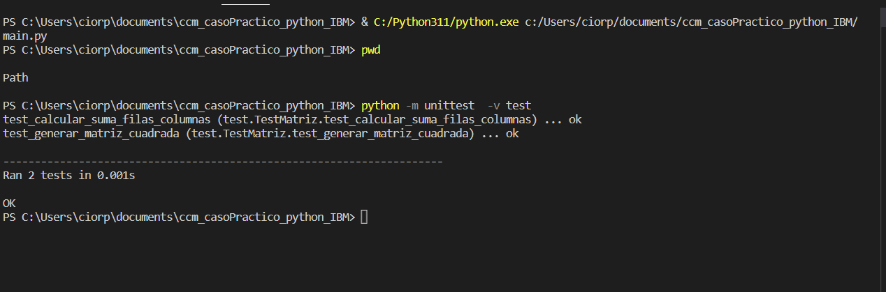

# ccm_casoPractico_python_IBM

## Generador de Matriz y Suma de Filas/Columnas

Este es un programa simple que genera una matriz cuadrada de tamaño N y calcula la suma de cada fila y columna de dicha matriz. La interfaz gráfica está desarrollada utilizando la biblioteca Tkinter de Python.

### Instrucciones de uso:

1. Ejecuta el programa.
2. Ingresa un número entero positivo N en el cuadro de texto proporcionado.
3. Haz clic en el botón "Generar Matriz y Calcular Sumas".

### Funcionamiento:

- El programa generará una matriz cuadrada de tamaño N con valores aleatorios entre 0 y 9.
- Mostrará la matriz generada en la interfaz gráfica.
- Luego, calculará y mostrará la suma de cada fila y columna de la matriz generada.

**Nota:** Asegúrate de ingresar un número entero positivo en el cuadro de texto. Si se ingresa un valor no válido, se mostrará un mensaje de error.

### Cómo funciona el código:

- La función `generar_matriz_cuadrada(tamano)` crea una matriz cuadrada de tamaño `tamano` con valores aleatorios entre 0 y 9.
- La función `calcular_suma_filas_columnas(matriz)` calcula las sumas de cada fila y columna de la matriz dada.
- La función `imprimir_matriz_en_interfaz(matriz)` convierte la matriz en una cadena legible para mostrarla en la interfaz gráfica.
- La función `mostrar_resultados_interfaz(sumas_filas, sumas_columnas)` muestra las sumas de cada fila y columna en una ventana emergente.
- La función `generar_matriz_y_calcular_sumas()` se ejecuta cuando se hace clic en el botón "Generar Matriz y Calcular Sumas". Recupera el valor de N, genera la matriz, la muestra en la interfaz y calcula y muestra las sumas.

### Requisitos del sistema:

- Python 3.x instalado.
- Biblioteca Tkinter incluida en la instalación estándar de Python.

### Instrucciones para ejecutar el programa:

1. Asegúrate de tener Python 3.x instalado en tu sistema.
2. Ejecuta el archivo `generador_matriz.py`.
3. Se abrirá una ventana con un cuadro de texto para ingresar el valor de N.
4. Ingresa un número entero positivo en el cuadro de texto y haz clic en el botón "Generar Matriz y Calcular Sumas".
5. La matriz generada y las sumas de filas y columnas se mostrarán en la ventana emergente.

### Notas adicionales:

- Si deseas modificar el rango de valores aleatorios para la matriz, puedes hacerlo en la función `generar_matriz_cuadrada(tamano)` modificando los valores `0` y `9` en `random.randint(0, 9)`.
- Ten en cuenta que este programa tiene un propósito educativo y de demostración, y puede requerir ajustes adicionales para adaptarse a casos de uso más complejos.

¡Disfruta utilizando el Generador de Matriz y Suma de Filas/Columnas! Si tienes alguna pregunta o problema, no dudes en contactarnos.


## Pruebas Unitarias

En este proyecto se han incluido pruebas unitarias para verificar el correcto funcionamiento de las funciones `generar_matriz_cuadrada()` y `calcular_suma_filas_columnas()`. Estas pruebas se implementan utilizando la biblioteca `unittest` de Python.

### Instalación y Ejecución

Asegúrate de tener Python 3.x instalado en tu sistema.

1. Ejecuta el archivo `test_matriz.py`.
2. Las pruebas automatizadas se llevarán a cabo y se mostrará el resultado de cada prueba.

### Descripción de las Pruebas

#### Prueba `test_generar_matriz_cuadrada()`

Esta prueba verifica que la función `generar_matriz_cuadrada(tamano)` genere una matriz de tamaño `tamano x tamano`. Se ha utilizado un tamaño de matriz de 3 como ejemplo.

```python
def test_generar_matriz_cuadrada(self):
    matriz = generar_matriz_cuadrada(3)
    self.assertEqual(len(matriz), 3)  # Verifica que la matriz sea de tamaño 3x3
## Prueba `test_calcular_suma_filas_columnas()`

Esta prueba utiliza una matriz de ejemplo para verificar que la función `calcular_suma_filas_columnas(matriz)` calcule correctamente las sumas de las filas y columnas de la matriz dada.

```python
def test_calcular_suma_filas_columnas(self):
    matriz = [[1, 2, 3], [4, 5, 6], [7, 8, 9]]
    sumas_filas, sumas_columnas = calcular_suma_filas_columnas(matriz)
    self.assertEqual(sumas_filas, [6, 15, 24])  # Verifica las sumas de las filas
    self.assertEqual(sumas_columnas, [12, 15, 18])  # Verifica las sumas de las columnas
##Resultado de las Pruebas
Al ejecutar el archivo test_matriz.py, las pruebas se llevarán a cabo y se mostrará el resultado de cada una de ellas. Si todas las pruebas pasan sin errores, significa que las funciones generar_matriz_cuadrada() y calcular_suma_filas_columnas() están funcionando correctamente. En caso contrario, se mostrarán mensajes de error indicando qué pruebas han fallado y podrás identificar y corregir los problemas en el código.

<p aling="center"></p>